# README

# FINAL PROJECT

###### 2021/11/17 ~ 2021/11/25   

### **📌 팀원 정보 및 업무 분담**

- #### 윤지영
    
    - Movie api 기초
    - Community
    - Accounts
- #### 오수경
    
    - Vue Client 기초
    - Movies
    - Design


## 1. **목표 서비스 구현 및 실제 구현 정도**

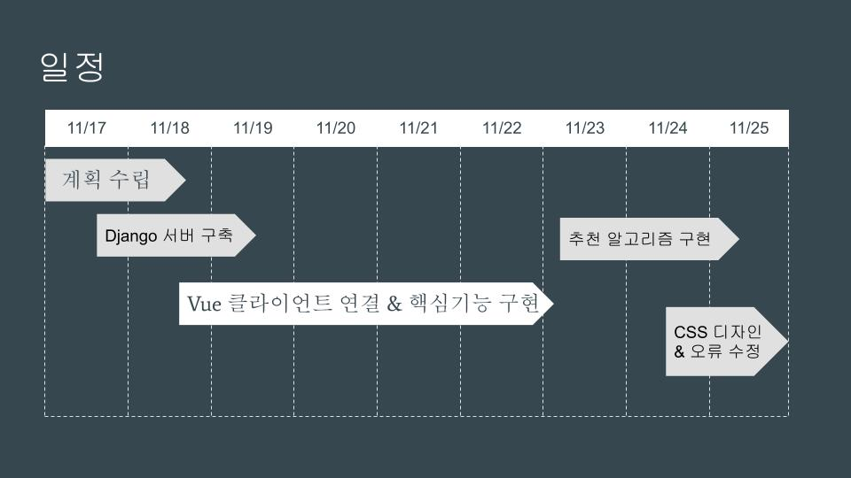

### 📌 목표 서비스 구현

- 영화 정보 기반 추천 서비스 및 커뮤니티 서비스 구성
- 백엔드(Django REST API 서버) 와 프론트엔드(Vue.js) 를 분리하여 웹 서비스 구현


### 📌 사용 아키텍처

- Django REST API 서버 & Vue.js


### 📌 추천 알고리즘

- `Clova Face Recognition API` 를 활용한 표정 분석 결과를 기반으로 장르별 영화 추천
  
    ```python
    # 감정별 추천 장르 
    "화남"               : ['액션','애니메이션','코미디','전쟁','범죄','모험'],
    "역겨움,기분 나쁨"    : ['드라마','가족','음악'],
    "근심,두려움"         : ['음악','코미디','모험'],
    "웃음, 즐거움"        : ['로맨스','모험','애니메이션'],
    "무표정"              : ['코미디','공포','액션','스릴러','전쟁'],
    "슬픔, 진지함"        : ['가족','드라마','다큐멘터리'],
    "놀람,당황"           : ['음악','코미디','모험'],
    "미소"                : ['코미디','공포','액션','스릴러','전쟁'],
    "말하는,표정이 풍부한" : ['SF','판타지','범죄','역사','서부'] 
    ```
    
    - `추가 추천 >` 랜덤 카드 뽑기 게임을 통해서 10 개의 영화 추천


### 📌 기본 기능 구현 목표

- Movie
    - 관리자 페이지에서 영화 등록 / 수정 / 삭제
        - 건의 게시판의 admin 버튼 클릭 시 새 페이지가 열리며 Django admin 페이지로 이동
    - TMDB & 영화진흥위원회 API 를 활용하여 DB seeding 최소 50개 이상 저장
    - 영화 추천 알고리즘
        1. 업로드된 사진을 기반으로 얼굴 인식 API로 감정을 분석하여 현재 감정에 따른 장르별 영화 추천   
        2. 랜덤으로 카드 제공하여 추천 
    - HTTP Method, 상태 코드는 상황에 맞게 적절하게 반환 + 필요에 따라 에러 페이지 구성
        - Django에 작업을 요청했는데 에러메시지가 발생하면 Django에서 보낸 메시지를 기반으로 사용자에게 에러 창 출력

- Community
    - 영화 관련 글 작성 가능한 커뮤니티 구성
        - 영화 상세 페이지에서 한줄평 & 별점 등록 / 수정 / 삭제
        - 리뷰 / 건의 / 자유 게시판에서 영화에 대한 자유로운 게시글 작성 / 수정 / 삭제
            - 로그인한 사용자만 가능  / 수정, 삭제는 본인만 가능
    - 게시글 & 댓글 수정시각 및 생성시각 표시
        - 사용자 친화적으로 구현하기 위해 댓글은 방금전, 1분전 등으로 표시 + 게시글은 시각을 `YYYY - mm -dd yy:mm` 형식으로 표현


### 📌 추가 기능 구현 목표

- Movie
    - [x]  영화 정렬할 때, transition-duration 속성 적용하여 UI 향상
        - [x]  영화 러닝타임, 인기도, 장르전체, 개봉일 기준으로 정렬 드롭다운 구현
    - [x]  영화 상세정보창 modal을 이용하여 UI향상
        - [x]  상세 정보 페이지를 들어가기 전 마우스 hover를 통해 간략한 정보 볼 수 있도록 구현
    - [x]  영화 제목 입력 받아 서치할 수 있는 기능 적용
        - [x]  offcanvas 스타일 활용
    - [x]  영화 찜목록 등록

- Community
    - [x]  자유 게시판 카테고리 분류 → 영화 추천 / 잡담/ 건의 등
        - [x]  각 카테고리별로 분류 및 필터 구현
        - [x]  리뷰, 자유 게시판에서 내가 팔로우하고 있는 사람의 글만 볼 수 있게 필터 적용
        - [x]  게시판 pagination 적용
    - [x]  리뷰 → 댓글 & 좋아요
    - [x]  리뷰 게시판에서 영화 검색할 때, 자동완성 기능 구현
    - 프로필 페이지
        - [x]  유저 팔로우 기능
        - [x]  내가 찜한 영화 목록 & 작성한 게시글, 댓글, 팔로워, 팔로우 목록 출력
        - [x]  프로필 이미지 등록
            - [x]  프로필 페이지 및 댓글 등록 시 출력
    
- 부가 기능
    - [ ]  kakaomap API 를 활용한 근처 영화관 찾기 기능 → 취소
    - [ ]  카카오, 깃헙 등 소셜 로그인 기능 → 취소
    - [ ]  잘못된 url 요청이 올 시 에러 페이지 디자인 → 취소
    
- 추천 알고리즘 아이디어
    - 리뷰 최다 작성 장르 위주 추천
    - 찜한 장르 기준 추천
    - 회원가입할 때 고른 영화 기반 추천
    - 성격 mbti 유형에 따른 추천
    - 카드 뒤집기 게임, X 피하기 게임, 말랑이 거래 등으로 선택한 영화 기반 추천
    - **(최종 채택!!)**  구글 or 네이버 얼굴인식 API 에 따라 추천  ****
        - 기분에 따라 분석하여 추천
    


## 2. 사용 기술 (Tool)

### 📌 공통

- GIT 형상관리
- VS Code
- Chrome Browser

### 📌 frontend

- `Vue.js 2.X` / `Node.js LTS version`
- `app.diagrams`, `ovenapp` 설계 디자인(ERD, 화면설계)
- `vuex` 를 이용한 `Vue.js` 상태 관리 처리
- `Youtube API` iframe으로 영화 trailer 상세정보에 구현
- `vuetify`, `Bootstrap` framework로 웹 디자인
- `axios`를 이용한 비동기 서버-클라이언트 통신 서비스 구현

### 📌 backend

- `Django 3.2+` / `Python 3.9+`
- `TMDB`, `영화 진흥 위원회 API` 영화 데이터 DB에 저장
- `Pillow` ImageField 생성을 통한 image데이터 전송 구현
- `Clova Face Recognition API` 를 사용하여 영화 추천 알고리즘 구현
- `Django Rest Framework`를 이용한 웹 API 구축


## **3. 화면 및 DB 설계**

### 📌 ERD (DB 설계)

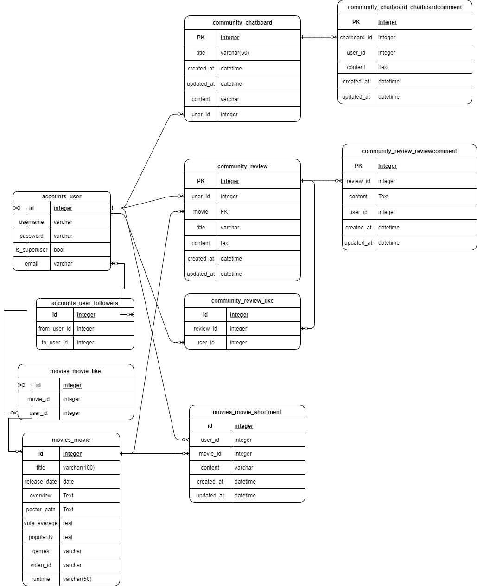


### 📌 컴포넌트 구조

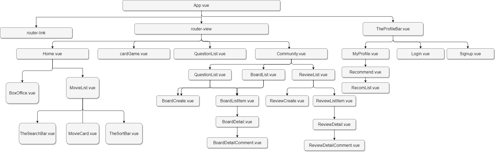


### 📌 URL Patterns

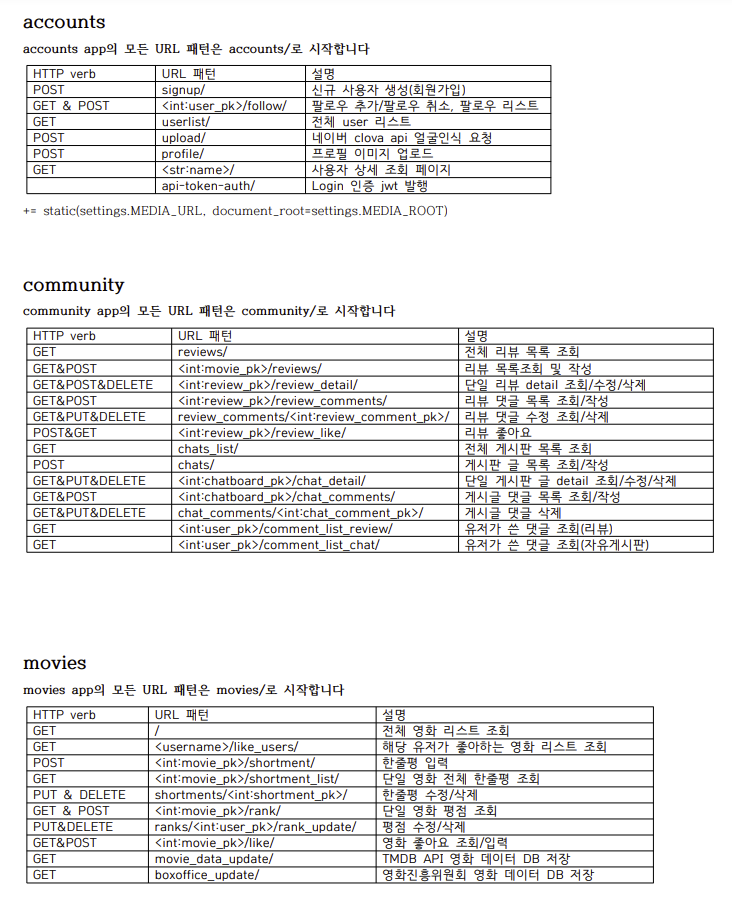


### 📌 구현 디자인 (화면 설계)

- **Home 화면**
  
    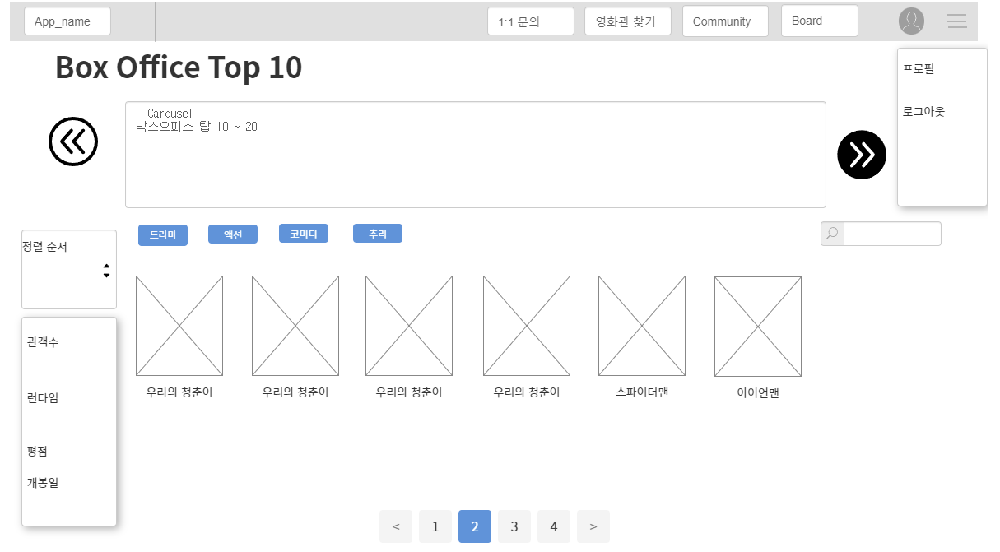
    
    - **Movie 상세정보 페이지 (Modal 형태 구현)**
    
    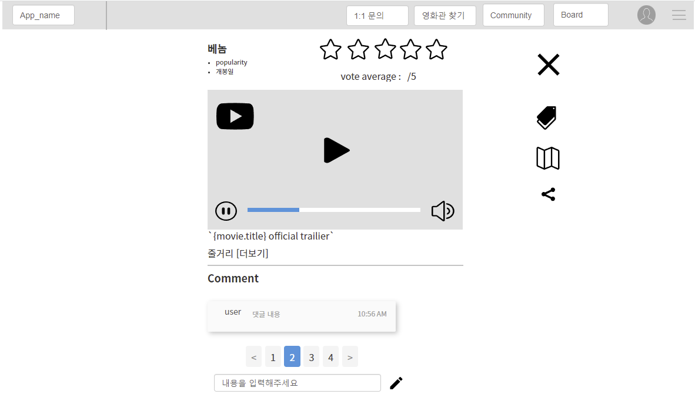
    

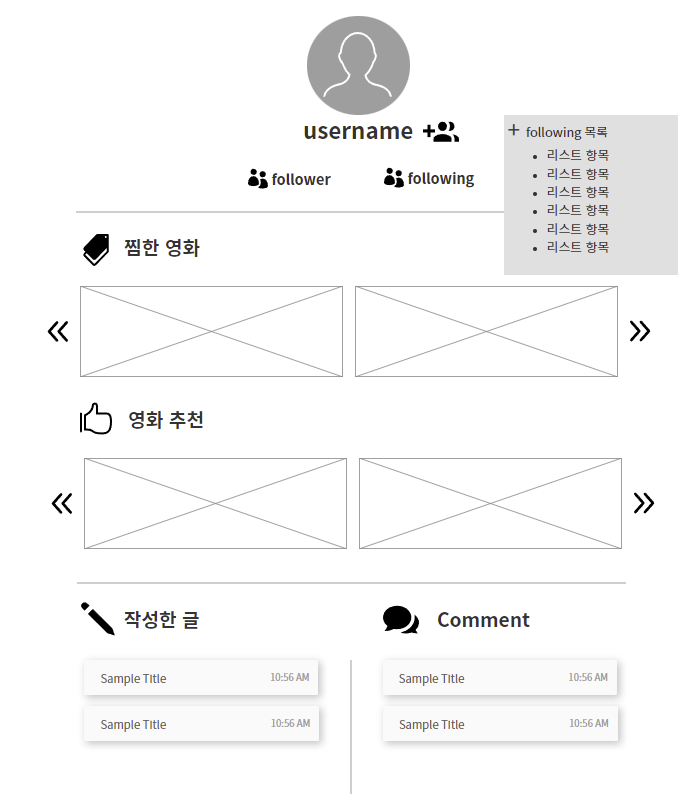

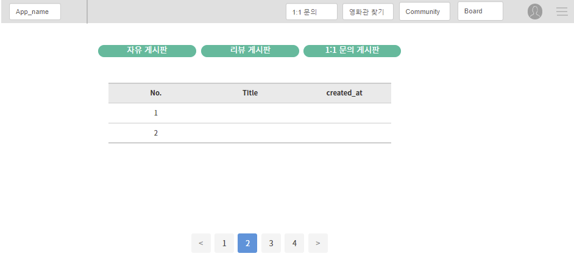


### 📌 구현

- 자유 게시판 카테고리 분류 → 영화 추천 / 잡담/ 건의 / 파티모집 등
    - 리뷰, 자유 게시판에서 내가 팔로우하고 있는 사람의 글만 볼 수 있게 필터 적용
    
    - 리뷰 게시판에서 영화 검색할 때 자동 완성 기능 추가
      
        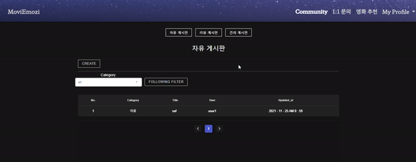
        
    - 게시판 pagination 적용


- 리뷰 → 댓글 & 좋아요
- 영화 정렬할 때, transition-duration 속성 적용하여 UI 향상
    - 영화 러닝타임, 인기도, 장르 전체, 개봉일 기준으로 정렬 드롭다운 구현

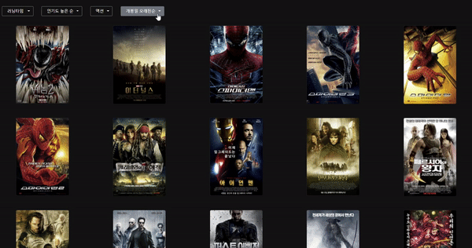

- 영화 상세정보창 modal을 이용하여 UI향상
    - 상세 정보 페이지를 들어가기 전 마우스 hover를 통해 간략한 정보 볼 수 있도록 구현
- 영화 제목 입력 받아 서치할 수 있는 기능 적용
    - offcanvas 스타일 활용
    
    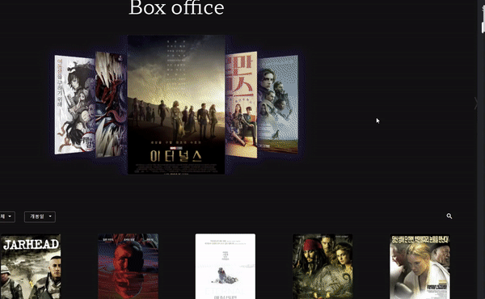
    
- 유저 팔로우 기능
- 영화 찜목록 등록
- 프로필 페이지에서 내가 찜한 영화 목록 & 작성한 게시글, 댓글, 팔로워, 팔로우 목록 출력
    - 추천 알고리즘 구현

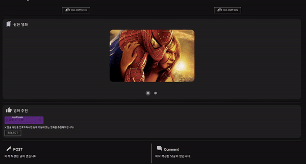

​		

- 프로필 이미지 등록
    - 프로필 페이지 및 댓글 등록 시 출력
      
        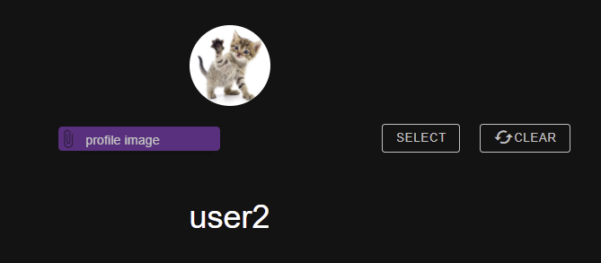
        

---


### 느낀점 및 고찰

- Django에 요청을 보낼 때, url 패턴을 위에서부터 찾아서 내려온다는 것을 깜빡하고 있었다가 에러 폭탄을 맞았었다.. `/follow/` url 이 `/<username>/` url 보다 아래에 있으면, follow 라는 username으로 요청을 보낸 줄 알고, 405 에러나 기타 다른 에러 혹은 원치 않은 결과가 발생한다. 이젠 url 패턴을 작성할 때 순서를 잘 지켜야 한다는 사실을 몸소 깨달을 수 있었다..

- model을 잘못 설정해서 중간에 추가해야 하는 일이 발생했는데 다른 model을 건드려서 field를 고치면 많은 문제가 발생할 것 같아서 새로 model을 만들어주었다.. 결국 사용할때 더 많은 과정이 필요했다... 설명을 처음부터 모델 구현을 꼼꼼히 잘 하자...!!!

- get_object_or_404를 자주 사용하다 보니 list로 받아야하는 것도 object로 받는 경우가 있었다.
  
    이럴 경우 `MultipleObjectsReturned` 에러가 발생하며 `objects.filter(user=user_pk)`로 변경해주었더니 `'QuerySet' object has no attribute '_meta'`  라는 에러였다.
    
    찾아보니 get_object는 queryset형태로 반환하는데 instance로 사용하려고 해서 발생하는 문제라고 한다. filter 뒤에  `.first()` 를 달아주면 첫 번째 상황을 반환해주기 때문에 object로 얻을 수 있다고 한다.. first로 했더니 update가 아닌 이전 값이 되는 것 같아서 `.last()`로 해주니 제대로 작동시킬 수 있었다. 
    
- 비동기로 실행시키다보니 시간차로 인해 undefined로 발생하는 오류가 많았다.
  
    setTimeout을 잘 활용하면 해결할 수 있는 부분이었다!
    
- DOM에 바로 반영되지 않는 문제도 자주 발생했는데
  
    배열로 상태를 체크하려고 하면 바로 반영이 되지 않는다는 것을 알았다. 
    
    → 아예 배열을 재할당 해주자, 그리고 끝날 때 마다 새로 업데이트 될 수 있는 함수를 실행시켜 주면서 해결하였다. 
    
- 새로고침시 state가 날아가는 문제가 로그인 유저를 확인하는데 많은 불편함이 있었다.
  
    → localstorage를 모듈화 해서 필요한 데이터를 localStorage에 올려놓는 방법을 선택했고
    
    모듈화를 통해 필요한 부분만 올려놓아서 속도가 느려지는 것도 방지할 수 있었다!
    
    모듈화가 처음이다 보니 많은 에러가 발생했는데 찾아보면서 많이 알게 된 것 같다!
    
- 자주 사용하는 git add, commit, push 이 정도만 익숙했는데 매번 branch를 활용하면서 익숙해질 수 있었다. 프로젝트를 하면서 이런 저런 부분을 많이 배운 것 같다.

- `vuex-persistedstate` 이용하여 localStorage에 저장할 수 있다는 점을 학습할 수 있었다.

- vue에서 이미지 업로드받아서 DB에 저장하는 건 이제 익숙해진 것 같다...거기에 더해서 Django 에서 media 파일이나 static 파일 쓸 때 왜 `urlpatterns +=` 를 작성하는지 알게 되었다. 역시 코드는 왜 여기에 쓰는지 알고 있어야 제대로 쓸 수 있는 것 같다.

- 프로젝트를 하면서 왜 많이 배운다는 건지 이번에 절실히 깨달은 것 같다. 페어와 둘이서 여기저기 찾아보면서 에러를 해결해나가는 과정에서 정말 Vue 와 Django 에 대해 많은 것을 학습할 수 있었다.

- 다만, 약 8일간 쉼없이 했음에도 아직 구현해보고 싶은 기능을 모두 구현하지 못했고, CSS 적인 부분도 급하게 마무리 짓게 되어 아쉬운 점이 많았다. 하고싶던 기능들을 추가로 구현하고 좀 더 손봐서 배포까지 해보고 싶다고 느꼈다..


자세한 오류 해결 과정 및 프로젝트 진행 과정은 notion 페이지 참고 - ([링크](https://reinvented-thrill-a49.notion.site/be4e641fe88d4c52a2fb773bdf2ad8cd))